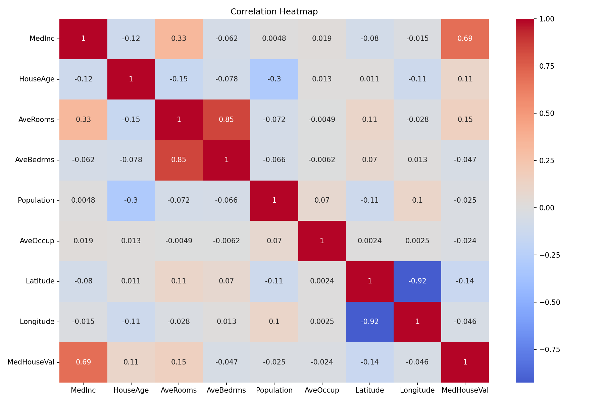
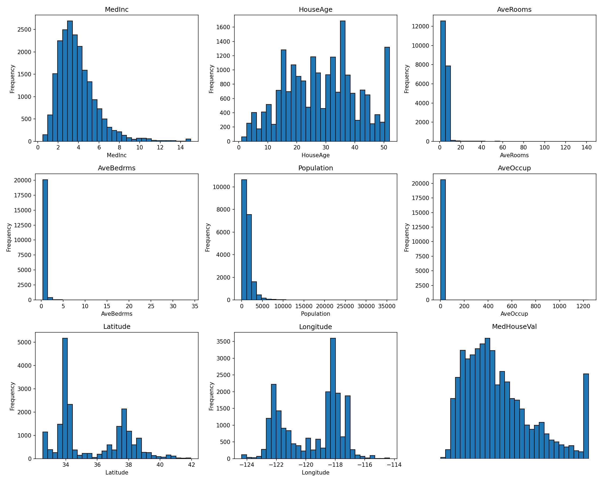
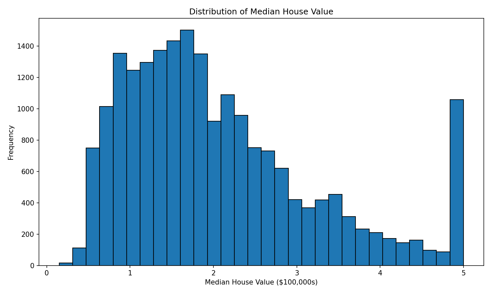
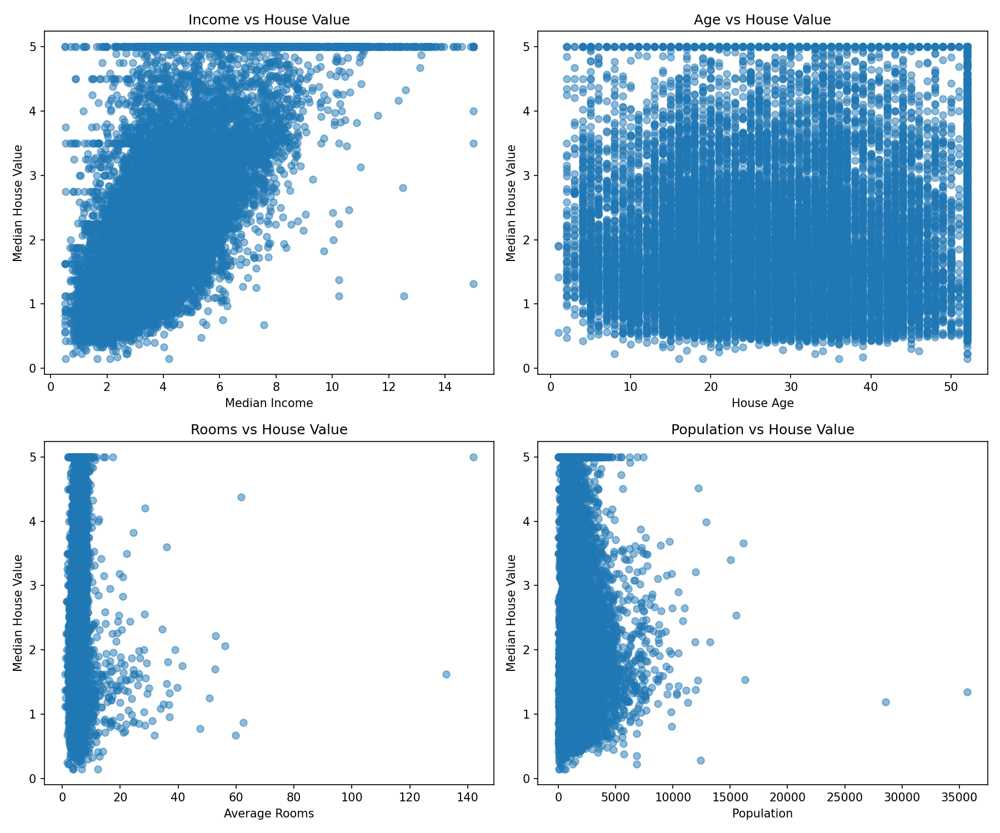
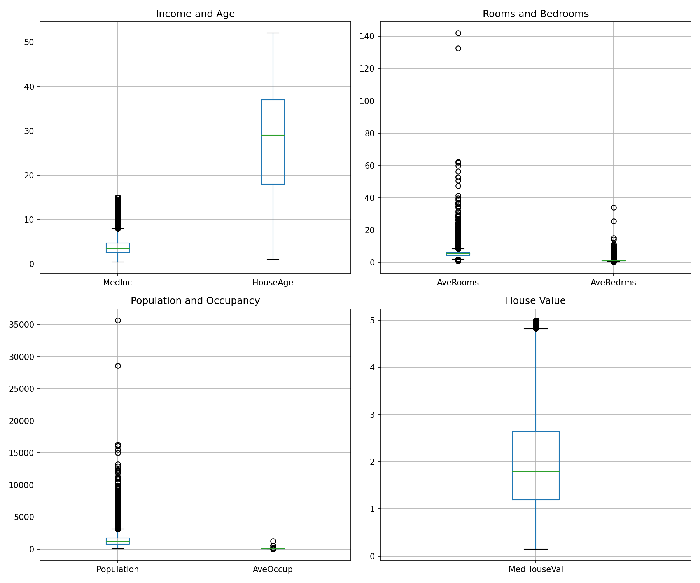

# Task 1: Machine Learning Prediction System - House Price Prediction

## Live Demo
🚀 **Try the live application:** [https://invoqe-housepriceprediction-dvwc5kgl2jnp7dr2nmxm6q.streamlit.app/](https://invoqe-housepriceprediction-dvwc5kgl2jnp7dr2nmxm6q.streamlit.app/)

## Overview
This project implements a machine learning system to predict house prices in California using the California Housing Dataset. It includes data preprocessing, exploratory data analysis, model training with multiple algorithms, and an interactive Streamlit interface for predictions.

## Analysis Plots











## Technologies Used
- Python
- Pandas
- NumPy
- Scikit-learn
- Matplotlib
- Seaborn
- Streamlit
- Joblib

## Project Structure
```
task1/
├── data/
│   ├── housing.csv              # Dataset
│   └── download_data.py        # Dataset download script
├── models/
│   ├── best_model.pkl           # Trained model
│   ├── scaler.pkl               # Feature scaler
│   └── feature_names.pkl       # Feature names
├── plots/
│   ├── correlation_heatmap.png  # EDA visualization
│   ├── feature_distributions.png
│   ├── target_distribution.png
│   ├── scatter_plots.png
│   └── boxplots.png
├── eda.py                       # Exploratory data analysis
├── train_model.py               # Model training script
├── app.py                       # Streamlit application
├── requirements.txt             # Python dependencies
└── README.md                    # This file
```

## Installation

1. Create a virtual environment:
```bash
python -m venv venv
venv\Scripts\activate  # On Windows
source venv/bin/activate  # On Linux/Mac
```

2. Install dependencies:
```bash
pip install -r requirements.txt
```

## Usage

### Step 1: Download Dataset
```bash
python data/download_data.py
```

### Step 2: Perform Exploratory Data Analysis
```bash
python eda.py
```
This will generate visualizations in the `plots/` directory.

### Step 3: Train the Model
```bash
python train_model.py
```
This will:
- Preprocess the data
- Train multiple models (Linear Regression, Ridge, Lasso, Random Forest, Gradient Boosting)
- Compare model performance
- Save the best model to `models/` directory

### Step 4: Run the Streamlit Application
```bash
streamlit run app.py
```

The application will open in your browser at `http://localhost:8501`

## Methodology

### Data Preprocessing
- Loaded California Housing Dataset from scikit-learn
- Split data into training (80%) and testing (20%) sets
- Applied StandardScaler for feature normalization

### Exploratory Data Analysis
- Analyzed feature distributions
- Performed correlation analysis
- Identified relationships between features and target
- Detected outliers using boxplots

### Model Training
Trained and compared 5 different models:
1. Linear Regression
2. Ridge Regression
3. Lasso Regression
4. Random Forest Regressor
5. Gradient Boosting Regressor

### Model Evaluation
Evaluated models using:
- Mean Squared Error (MSE)
- Mean Absolute Error (MAE)
- Root Mean Squared Error (RMSE)
- R² Score
- Cross-validation

## Results

The best performing model was Random Forest Regressor, achieving an R² score of approximately 0.80-0.82 on the test set.

## Features
- Interactive prediction interface
- Feature importance visualization
- Real-time predictions based on user input
- Comprehensive EDA visualizations
- Multiple model comparison

## Dataset Information
- Source: California Housing Dataset (1990 California Census - Real Public Dataset)
- Samples: 20,640 districts
- Features: 8 numerical features
- Target: Median house value (in $100,000s)
- Data Source: Scikit-learn (originally from 1990 California Census)

## License
This project is created for the Invoqe AI/ML Internship Program.